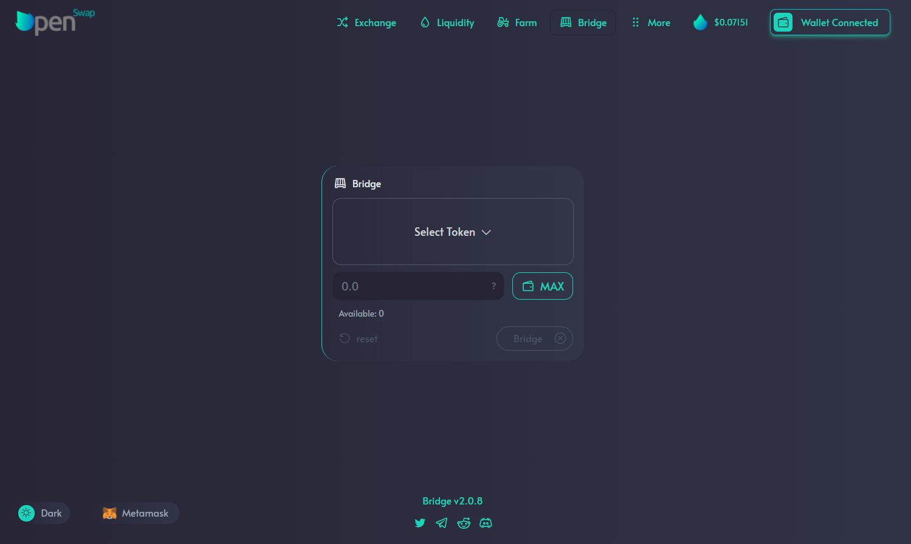
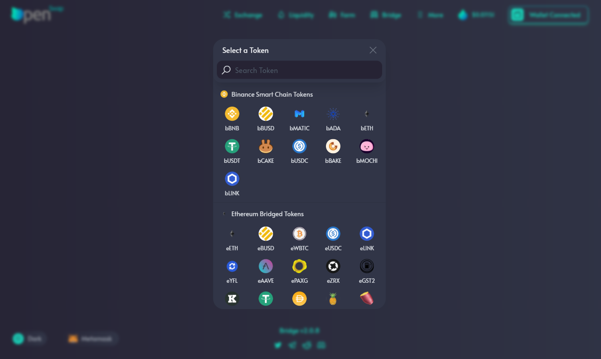
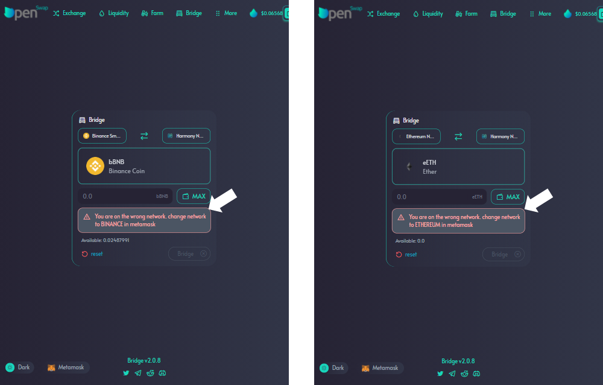
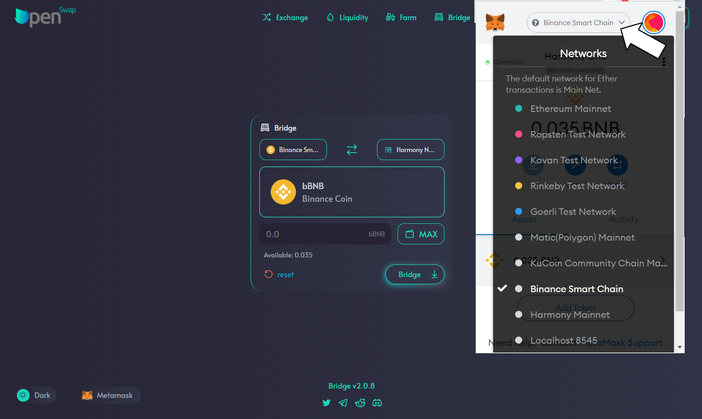
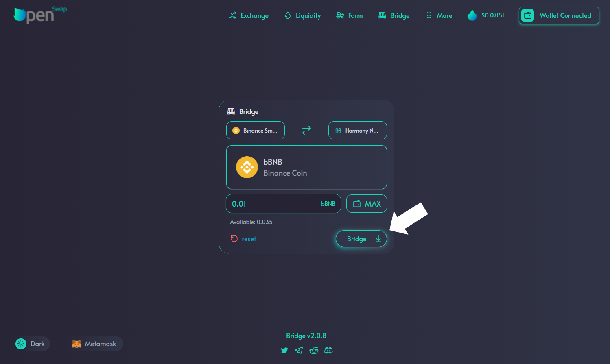

# OpenSwap $ONE click bridge

In an attempt to add simplicity to your life, OpenSwap created the $one click bridge.  This is a simpler and smoother way to use the Horizon bridge support by Harmony.  The bridge will allow you to transfer tokens / coins across networks.  Currently you can bridge assets to / from Harmony on the Ethereum and Binance Smart Chain networks.  Terra and Polygon are planned in to be released in the near future.

It is important to confirm that you have the appropriate tokens available in your wallet for any network fees.  Use the chart below as a reference on the network and tokens needed for fees.

| NETWORK                     | MetaMask Network    | Token needed for Fees |
| --------------------------- | ------------------- | --------------------- |
| Ethereum Network            | Ethereum Mainnet    | ETH                   |
| Binance Smart Chain Network | Binance Smart Chain | BNB                   |

****\
**Let's start bridging some assets**

Click on 'Bridge' in the top menu to view the main bridge page. &#x20;

Click on 'Select Token' to choose the token you will be bridging over.  A pop-up will appear letting you choose from any token available.  Click on the token icon to populate it into the bridge.

Based on the token you select, you will receive a message to change to the correct network in your wallet.  At this time you can access your wallet and change to the appropriate network.

For MetaMask wallets, click on your wallet and go to the top of the wallet area; in the center is a drop down list of the networks.  Click on the appropriate network for the transaction.  When you select the correct network, the red highlight message regarding the wrong network will disappear.

&#x20;Enter in the amount you would like to bridge over and click 'Bridge'. &#x20;

Once you click 'Bridge', you will need to confirm that transaction in your wallet.  Once confirmed, the 'Bridge' icon will show a rotating circle to signify progress on the bridge.  When the bridge is complete, the icon will no longer be in motion.  The tokens are successfully bridged over to Harmony and available in your wallet.

At this time you can use the tokens to swap , farm, or hold.  Enjoy!

**But wait!!!  My bridged tokens are not showing up in my wallet!!!**

It is important to note, if the token has never been in your wallet before, you may need to add the token to Wallet.  Even though a token is not appearing in your wallet, that doesn't mean your tokens are lost.  If you check your address on the Harmony Explorer, all of your tokens will display there.  Wallets are just an interface for the blockchain network.  Hence why you need to add the token for it to be visible in your wallet.

Follow the link below to learn how to add tokens so they appear in your wallet.&#x20;


[adding-tokens-to-a-wallet.md](../../guide/tokens/adding-tokens-to-a-wallet.md)


