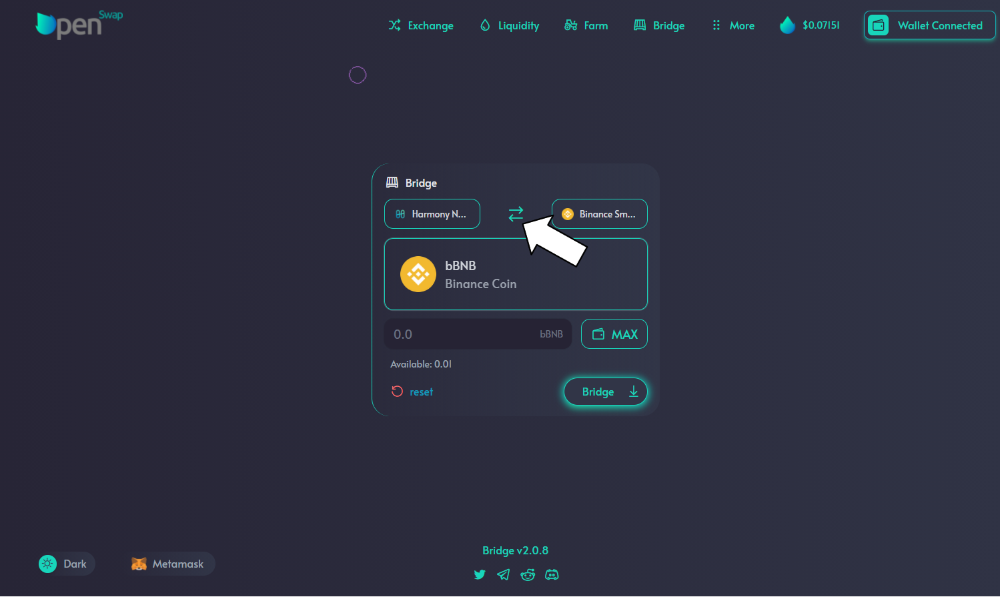

# Bridging from Harmony

The process of sending tokens from harmony back to the perspective network is just as simple as bringing them over.  All of the steps are the same with a little twist. After selecting the token to bridge, click the 'Swap' button located between the two networks.  This will reverse the networks and have you sending the token from Harmony to the original network.  At this time, you will follow all the same steps to complete the bridge.

