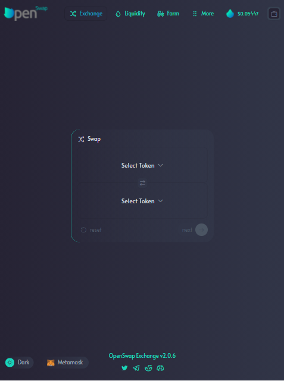
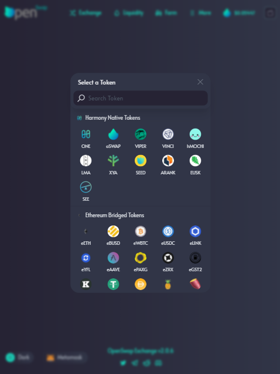
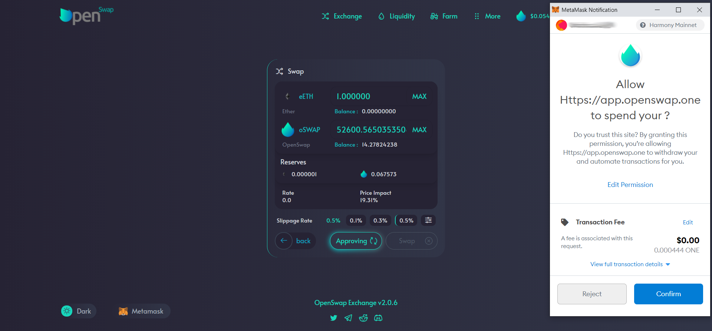
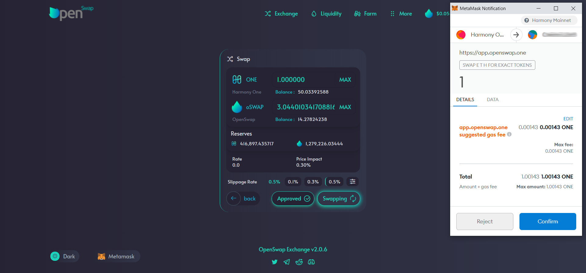
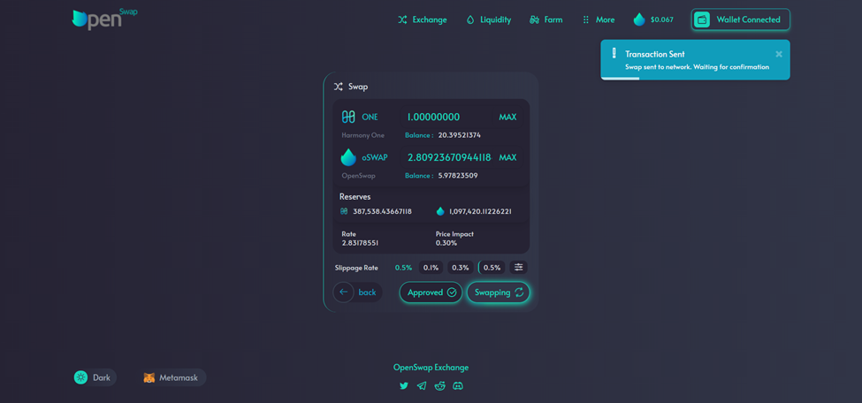
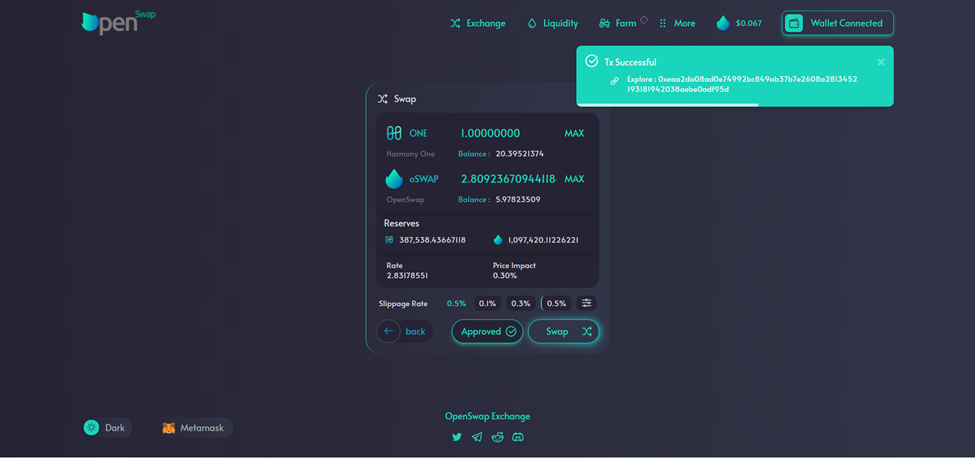

# Executing a Trade

Now that you have One coins in your wallet, you can pay for the gas needed to send transactions.

To swap your tokens, exchanging one for another, click the “Exchange” tab on the top navigation.

On this screen you will see a box with the ability to select two tokens. The upper ‘Select Token’ is the token you are using to swap for the lower ‘Select Token’. &#x20;

Clicking on one of the 'Select Token' areas will pop-up a list of the tokens available.  By choosing a token, it will populate the token in the swap area.

Once you have two tokens selected, click 'Next'.   A pop-up will provide information on the trade including: the current reserves of each token, rate, current price, slippage, and the price impact.  Click in the numeric field next to the token and then enter amount to swap for this transaction; this will automatically calculate the amount for the other token involved in the swap.  At any time, you can click 'Back' to be taken back to the original exchange screen.

.png>)

When swapping a token that you have not previously swapped, you will be asked to allow the contract to spend the amount you have entered : simply click 'Approve' to send the transaction to your wallet and continue. NOTE: if you do not approve the transaction will fail, and swap will not occur. &#x20;

If the button states 'Approved', you have previously approved the token and may continue directly to the 'Swap' button

Once approved, click 'Swap' to continue and finalize the transaction.  Your wallet pop-up will ask you to confirm the details (Amount + Gas Fees) for the transaction.  Click 'Confirm' on your wallet pop-up to complete the transaction.

Once you have confirmed the transaction in your wallet, you will receive a notification in the top right hand corner stating the transaction has been sent

Once the transaction has been completed you will receive a final notification that the transaction was successful.  If there was a problem with the transaction, you will receive notification informing you of the error.

