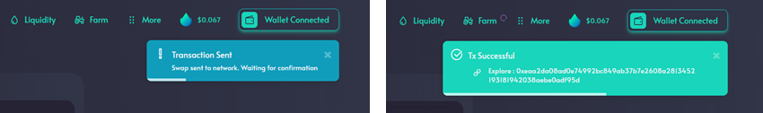
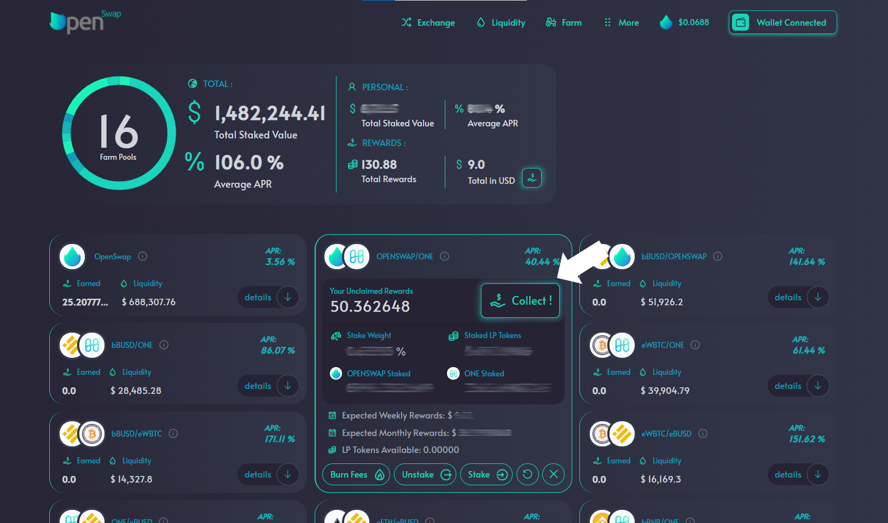

# Claiming Rewards

To claim your rewards, click on 'Farm' in the top menu.  There are two options: Claim all or Claim individual pools.

### Claim All

To claim rewards in all of the pools you are involved in, click on the 'Claim All' button in your Personal Farming Analysis at the top of the page.  This will prompt action in your wallet to complete the transaction. As covered in previous sections, you will receive two notifications when you submit a transaction: transaction sent and Transaction successful.  Once the transaction has been successful, the tokens will be available in your wallet.&#x20;

### Claim Individual Pool

To claim rewards in an individual pool, click on the 'details' button of the pool.  Once viewing the details of the pool, click on the 'Claim' button. When you click 'Collect', your wallet will prompt you to confirm the transaction.  As covered in previous sections, you will receive two notifications when you submit a transaction: transaction sent and Transaction successful.  Once the transaction has been successful, the tokens will be available in your wallet.&#x20;

