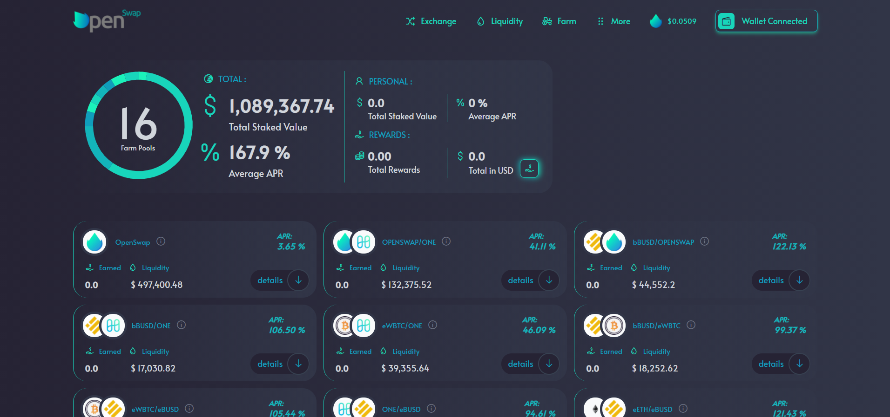

# How to Stake LPs

To stake your tokens, you must first check which token pairs are eligible for staking in the ‘Farm’ menu.  Find the pair you would like to stake and click 'Details'

Next, you have to stake the LPs. To do so simply click on 'Stake'.

.png>)

You will be asked to enter the amount you wish to deposit.  You can withdraw them anytime, along with your rewards.&#x20;

If you have not previously approved staking to the pair, you will be required to approve spending the LP tokens.  By approving, it allows the smart contracts to take those LP tokens from your wallet and stake them on the site.  Click the 'Approve' button to have the approval transaction populate in your wallet and click the confirm in your wallet pop-up.  If you have previously approved a stake for this pair, you can continue with the 'Stake' button.

Once you click 'Stake', you will need to confirm that transaction in your wallet.  Once confirmed, you will receive the same two notifications that appear for executing a trade: confirming the transaction has been sent and successful completion of the transaction.&#x20;

Congratulations, you will now be earning OpenSwap as a reward for providing liquidity!  You can see your current rewards for each pair under the pair details. &#x20;

You should know that you can compound your rewards by adding your OpenSwap to the ONE/OPENSWAP Pools and stake your LP tokens again. You can do this indefinitely.
