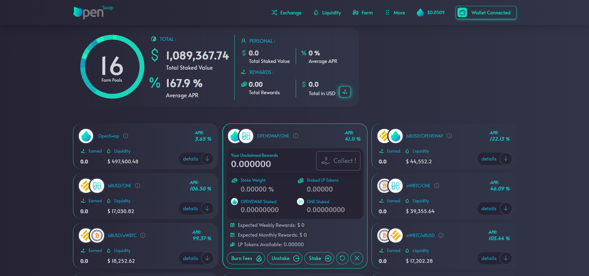
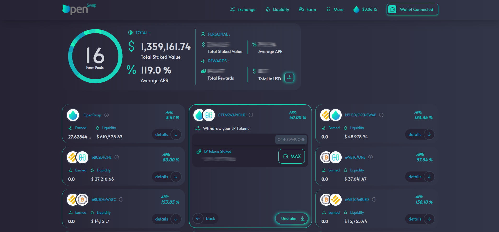

# Remove Staked LPs

To remove staked tokens, click on 'Farm' in the menu.  Find the pair you would like to unstake and click 'Details'

Click on 'Unstake'. It will bring you to a screen to enter in the number you wish to unstake, then click the 'Unstake' button.  If you wish to unstake all of the LPs in the pool, you can use the 'MAX' button to auto populate the entire amount of LPs in that pool you own.

Once you click 'Unstake', you will need to confirm that transaction in your wallet.  Once confirmed, you will receive the same two notifications that appear for executing a trade: confirming the transaction has been sent and successful completion of the transaction.&#x20;

