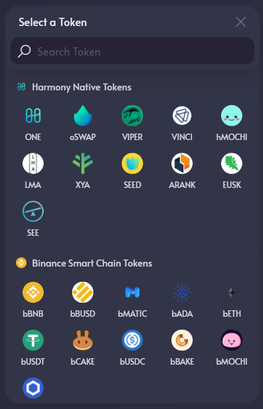
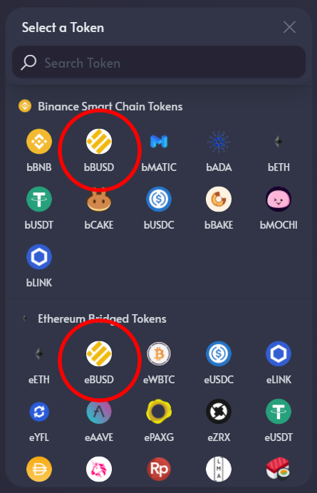
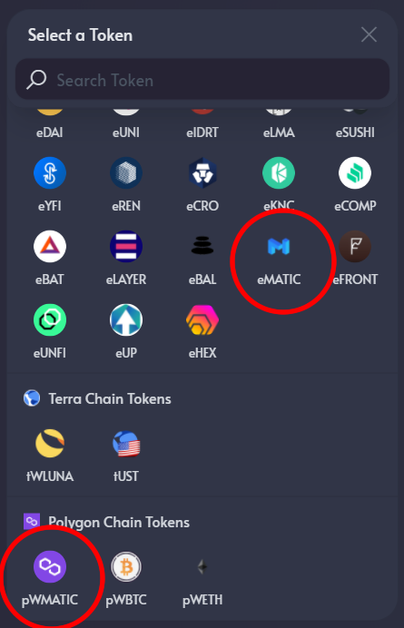

# Tokens

OpenSwap operates on the Harmony Protocol; thus all tokens available on OpenSwap are native to the network or have been bridged over to Harmony ([Click here to access the bridge guide](https://docs.openswap.one/bridge-assets/openswap-one-click-bridge)).  The tokens available have come from the following networks: Harmony, Binance Smart Chain, Ethereum, Terra, and Polygon.  To assist the end user in understanding where the tokens came from prior to ending up on the Harmony One Network, OpenSwap developed a new approach to the traditional naming convention to help improve the usability of tokens.

### **Token Naming Convention**

The first letter of each token will be designated as the network the token originally came from.\
\*if there is no lowercase letter in front of the token, it is native to the Harmony One Network\
b = Binance Smart Chain\
e = Ethereum\
t = Terra\
p = Polygon\
\
Since there are several tokens that can be on each network, this will help the end user designate where the token originally came from.\
\
For example:\
BUSD\
\- bBUSD is the BUSD token from Binance Smart Chain bridged to Harmony\
\- eBUSD is the BUSD token from Ethereum bridged to Harmony

\
\
MATIC\
\-bMATIC is the MATIC token from Binance Smart Chain bridged to Harmony\
\-eMATIC is the MATIC token from Ethereum bridged to Harmony\
\-pMATIC is the MATIC token from Polygon bridged to Harmony

****
