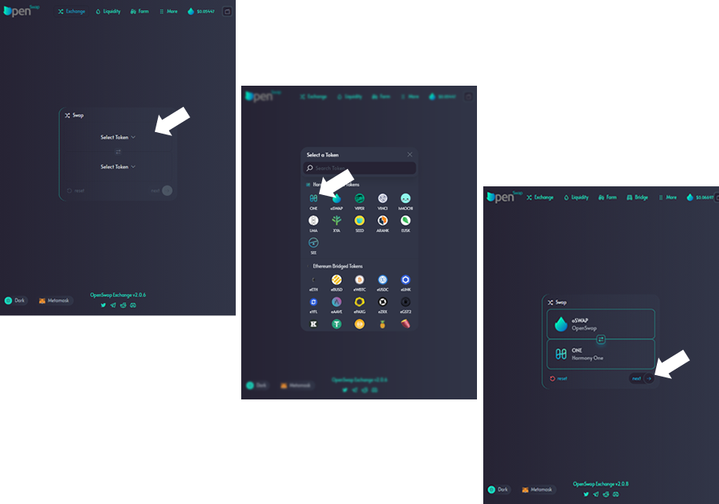
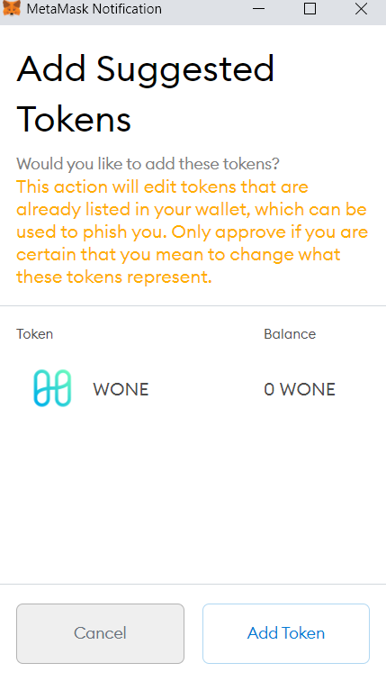

# Adding tokens to a Wallet

It is important to note, if the token has never been in your wallet before, you may need to add the token to your wallet.  Even though a token is not appearing in your wallet, that doesn't mean your tokens are lost.  If you check your address on the Harmony Explorer, all of your tokens will display there.  Wallets are just an interface for the blockchain network.  Hence why you need to add the token for it to be visible in your wallet.  There are two ways to add a token to your wallet.

OpenX HRC20 Token Address : 0x01A4b054110d57069c1658AFBC46730529A3E326

### **Adding tokens to your wallet directly**

For a Harmony wallet, enter your Harmony Wallet click on 'HRC20'.  Click the plus sign at the bottom of the popup. In the 'Token Contract Address' enter in the oSwap address (0xc0431Ddcc0D213Bf27EcEcA8C2362c0d0208c6DC).  Click Add.

For a Metamask wallet, enter your Metamask wallet and scroll to the bottom of the popup. Click 'Import Tokens'. In the 'Token Contract Address' enter in the oSwap address (0xc0431Ddcc0D213Bf27EcEcA8C2362c0d0208c6DC).  Click 'Add Custom Token' button.

### **Adding Tokens to your wallet through OpenSwap**

To do this, click 'Exchange' in the menu.  Click on 'select token' and choose the token you would like to add.  Repeat this process for the lower 'Select Token'. Once you have two tokens selected, click 'next'.  &#x20;

Click on the 'Plus Sign' next to the token.  Your wallet will prompt you to add the token.

Once you add the token to your wallet, the token and quantity you own will appear in your wallet. &#x20;
