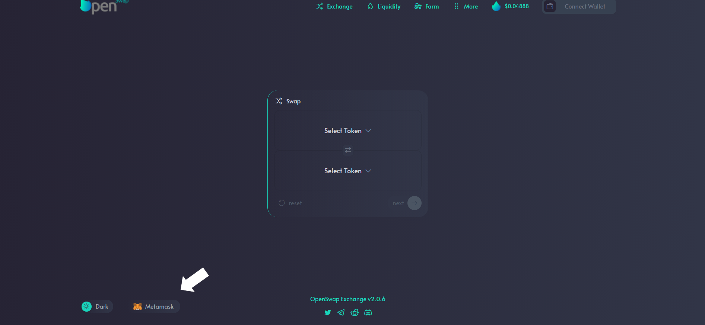

# Wallets

Currently, OpenSwap supports Metamask. &#x20;

If you have one of the supported wallets, you can click on the button in the top right 'Connect Wallet' or the Wallet icon.  This will prompt action in your wallet to allow the website to connect.  Once connected, you will be able to use the full features of OpenSwap.

You can change between the type of wallet in the bottom left corner of the site.

