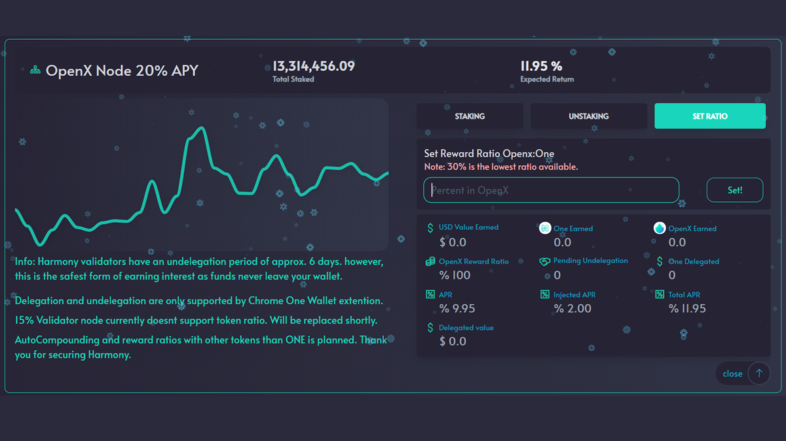

# Delegating $ONE on OpenSwap

With OpenSwap, you have the ability to control your delegated tokens directly through the OpenSwap website on the 'Farm' page. Granting the ability to stake / unstake and view details about your delegated tokens all on OpenSwap. The ability to choose the percentage of rewards you would like to receive in OpenX grants the user more flexibility with their rewards.

This interface allows you to stake or unstake $ONE with the validator directly through the OpenSwap website while using MetaMask or the Harmony Browser Wallet. Alleviating the need to visit multiple websites unnecessarily. OpenSwap is your one stop shop for DeFi.

### Only Harmony Validator with Auto-Compounding

OpenSwap grants you the ability to compound your $ONE rewards directly into an OpenX LP and have it staked automatically! This exact process will happen several times a day. This puts your validator rewards to work for you automatically and often.

### Control your destiny: Choose the percentage of OpenX rewards

The 20% APY Node Validator has always produced 100% of rewards in OpenX. Through the interface on OpenSwap, you can now select the percentage of rewards you would like to receive in OpenX tokens. You may choose between 30% and 100%. Whatever percentage you select, those rewards will be used to market buy OpenX and send it to the delegator address. The remaining percentage of rewards will be issued to you as $ONE tokens. This process occurs multiple times a day.

For example, if you choose to receive 50% OpenX, your rewards will be 50% OpenX and 50% ONE. Makes it pretty easy to create a OpenX / ONE LP, stake, and farm.

### _**$ONE rewards airdopped**_

With the OpenSwap Validator, you will no longer need to go to the Harmony Staking site and claim the rewards for your $ONE tokens. All rewards, $OpenX and $ONE, will be sent directly to the delegator address. This transaction will occur multiple times a day; just sit back and watch your balance grow.

### Know more about your staked $ONE

Additional detailed information about your delegated tokens is now available on OpenSwap. Here is the information that will be available to you through the new interface on OpenSwap:\
➢Total delegated tokens\
➢Total pending undelegated tokens\
➢ Total amount of $OpenX earned\
➢ Total amount of $ONE earned\
➢ Total USD value of the rewards earned\
➢ APR% from Harmony Staking site\
➢ Injected APR% from the validator bonus rewards\
➢ Total APR% earned\
➢ Total USD value of the delegated tokens

The following sections will discuss staking, unstaking, and modifying your reward percentage.
