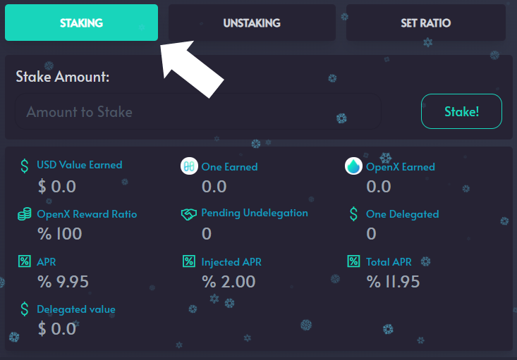

# Staking $ONE

**STEP 1:** Go to Openswap.one \
**STEP 2:** Click on ‘Farm’ in the menu\
**STEP 3:** Click ‘Details’ on the validator of your choosing\
**STEP 4:** Enter in the amount of $ONE to stake in the ‘Stake Amount’ area\
**STEP 5:** Click ‘Stake’\
**STEP 6:** A popup will appear from your wallet. Enter any security information required. Click ‘Approve’\
**STEP 7:** Click ‘Confirm and Sign’

You have now staked your Harmony $ONE and are earning rewards.

\
