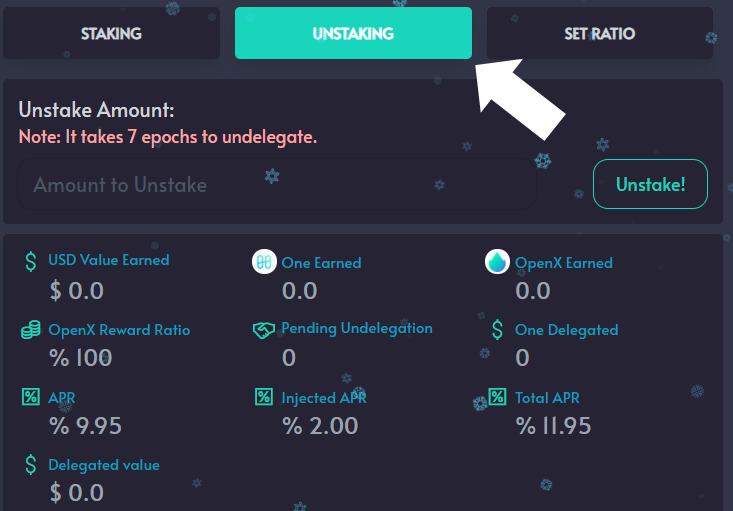

# Unstaking $ONE

**STEP 1:** Go to Openswap.one \
**STEP 2:** Click on ‘Farm’ in the menu\
**STEP 3:** Click ‘Details’ on the validator of your choosing\
**STEP 4:** Click on the ‘Unstaking’ tab\
**STEP 5:** Enter in the amount of $ONE to stake in the ‘Unstake Amount’ area\
**STEP 6:** Click ‘Unstake’\
**STEP 7:** A popup will appear from the Harmony Browser Wallet. Enter any security information required. Click ‘Approve’\
**STEP 8:** Click ‘Confirm and Sign’

You have now unstaked your Harmony $ONE and are earning rewards.

