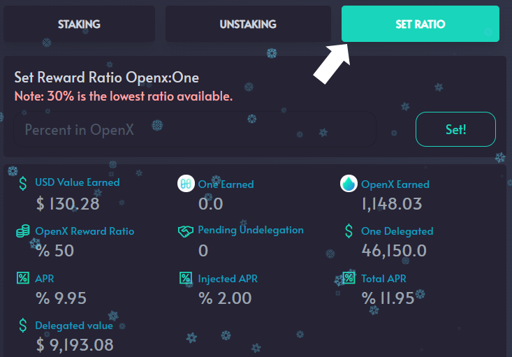

# Updating Reward Ratio

The 20% APY Node Validator has always produced 100% of rewards in OpenX. Through the interface on OpenSwap, you can now select the percentage of rewards you would like to receive in OpenX tokens. You may choose between 30% and 100%. Whatever percentage you select, those rewards will be used to market buy OpenX and send it to the delegator address. The remaining percentage of rewards will be issued to you as $ONE tokens and will be airdropped to the delegator's address. This process occurs every 30 minutes.

For example, if you choose to receive 50% OpenX, your rewards will be 50% OpenX and 50% ONE. Makes it pretty easy to create a OpenX / ONE LP, stake, and farm.

\
**STEP 1:** Go to Openswap.one \
**STEP 2:** Click on ‘Farm’ in the menu\
**STEP 3:** Click ‘Details’ on the validator of your choosing\
**STEP 4:** Click on the ‘Set Ratio’ tab.\
**STEP 5:** Enter the percentage of OpenX you would like to receive in the ‘Set Reward Ratio OpenX:One’. For example, you would enter ‘50’ if you would like to receive 50% of the rewards in OpenX tokens and 50% in ONE tokens\
**STEP 6:** Slick ‘Set’\
**STEP 7:** A popup will appear from the wallet. Enter any security information required. Click ‘Approve’\
**STEP 8:** Click ‘Confirm and Sign’

You have set the percentage of rewards you will receive in OpenX and ONE.

