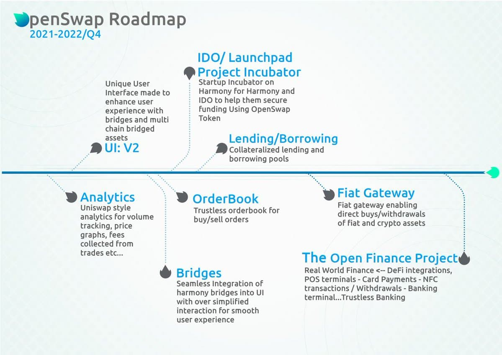

# Roadmap

A roadmap was created that aligns with the vision and future goals of OpenSwap.  The current roadmap is designed to run between Q2 2021 through Q4 2022

### Roadmap

### **Completed**

* User Interface: V2 (completed August 2021)
* Bridge: (completed September 2021)
* Audited by 0xGuard: (completed September 2021)&#x20;
* Analytics (completed October 2021)
* OpenSwap V2: OpenX, Opinions, Security upgrade and audits (completed October 2021)
